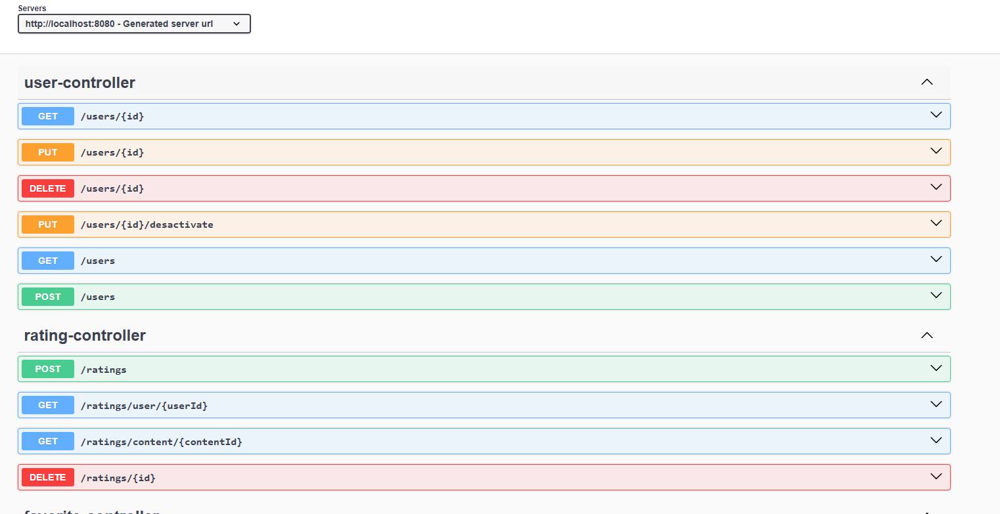

# 🎬 TV & Movie DB

A movie and TV show recommendation backend that provides personalized suggestions based on user ratings and favorites.

This project demonstrates the development of a REST API using modern Java backend technologies and best practices.

---

# ✨ Features

- 🔍 Search movies and TV shows using the TMDB API
- ⭐ Rate movies and TV shows
- ❤️ Save content to favorites
- 🤖 Personalized recommendations based on user ratings
- 🔐 JWT Authentication & Authorization
- 📖 API documentation with Swagger / OpenAPI

---

# 🏗️ Architecture

The project follows a **layered architecture** commonly used in Spring Boot applications:
Controller → Service → Repository → Database


### Layers

**Controller**
- Handles HTTP requests and responses
- Defines API endpoints

**Service**
- Contains business logic
- Coordinates between controllers and repositories

**Repository**
- Handles database operations using Spring Data JPA

**Database**
- PostgreSQL database for storing users, ratings, and favorites

---

# 🛠️ Tech Stack

**Backend**

- Java 21
- Spring Boot 3
- Spring Security
- JWT Authentication
- Spring Data JPA

**Database**

- PostgreSQL

**External APIs**

- TMDB API (The Movie Database)

**Documentation**

- Swagger / OpenAPI

---

# 📋 API Endpoints

## Users

| Method | Endpoint | Description |
|------|------|-------------|
| GET | /users | Get all users |
| GET | /users/{id} | Get user by ID |
| POST | /users | Create a new user |
| PUT | /users/{id} | Update user |
| PUT | /users/{id}/deactivate | Deactivate user account |
| DELETE | /users/{id} | Delete user |

---

## Content

| Method | Endpoint | Description |
|------|------|-------------|
| GET | /content/search?q= | Search movies and TV shows via TMDB |
| GET | /content/trending | Get trending content |
| GET | /content/{id} | Get content details |

---

## Favorites

| Method | Endpoint | Description |
|------|------|-------------|
| GET | /favorites/user/{id} | Get user's favorite content |
| POST | /favorites | Add content to favorites |
| DELETE | /favorites/{id} | Remove favorite |

---

## Ratings

| Method | Endpoint | Description |
|------|------|-------------|
| GET | /ratings/user/{id} | Get ratings made by a user |
| GET | /ratings/content/{id} | Get ratings for specific content |
| POST | /ratings | Add a rating |
| PUT | /ratings/{id} | Update a rating |
| DELETE | /ratings/{id} | Delete a rating |

---

# 🚀 Setup

## 1️⃣ Clone the repository
`git clone https://github.com/alejandrotg-code/tv-and-movie-db.git`

---

## 2️⃣ Create the configuration file

Create a file called:
`application-local.properties`

Inside:
`src/main/resources/`

Add the following configuration:

```properties
spring.datasource.url=jdbc:postgresql://localhost:5432/tv_and_movie_db
spring.datasource.username=your_username
spring.datasource.password=your_password

tmdb.api.key=your_tmdb_api_key

jwt.secret=your_token_secret
jwt.expiration=3600000

springdoc.swagger-ui.enabled=true
springdoc.api-docs.enabled=true
```

## 3️⃣ Run the application

Run the project with the local profile enabled.

Example (IntelliJ run configuration):
`--spring.profiles.active=local`

## 4️⃣ Access the API

- Base URL: `http://localhost:8080`
- Swagger UI: `http://localhost:8080/swagger-ui.html`

# 📖 API Documentation
The API is documented using Swagger / OpenAPI.


# 📌 Future Improvements

Planned improvements for the project:

- Add recommendation algorithm based on ratings similarity
- Pagination for endpoints
- Unit and integration tests
- Docker support
- Rate limiting for API protection
- Caching for popular content

# 👤 Author

Alejandro Tacoronte González

DAM Developer | AI & Big Data Student

🌐 Portfolio
https://alejandrotg.es/

💻 Linkedin
https://www.linkedin.com/in/alejandrotacoronte/
